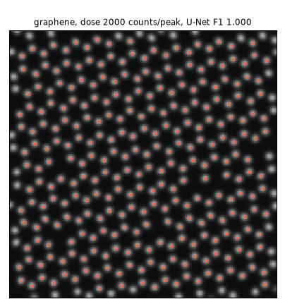
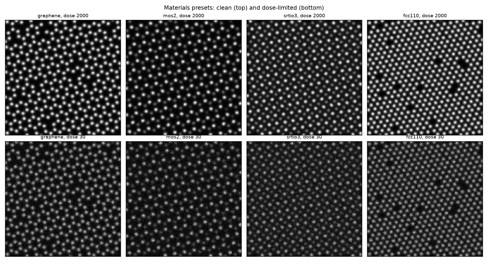

# stem-atom-finder

A benchmark and toolkit for atomic column detection in HAADF-STEM images.
It ships a physics-motivated simulator with four materials presets and
exact ground truth, five detectors (three classical, two learned), two
sub-pixel refiners, and a config-driven benchmark harness that answers the
questions a microscopist actually asks: which detector, at what dose, on
which material, with what threshold, and how well localised. Everything
runs on CPU; every committed number regenerates from a fixed-seed YAML
config.





## Headline results

Full tables and readings in [RESULTS.md](RESULTS.md); raw values in
`results/*.json`. Four findings, measured, not asserted:

**1. Below dose 30, detectors separate; the U-Net leads.** On a doped
lattice (5% brighter substitutional columns), detection F1 at each
method's fixed default threshold:

| Dose (counts/peak) | LoG | Local max | NCC | U-Net (seg) |
|---|---|---|---|---|
| 1 | 0.812 | 0.922 | 0.053 | **0.945** |
| 4 | 0.914 | 0.991 | 0.550 | **0.995** |
| 8 | 0.958 | 0.995 | 0.962 | **0.997** |
| 30 | 0.997 | 0.998 | 0.998 | 0.998 |

**2. The threshold story is about defaults, not retuning.** An earlier
version of this repository framed the U-Net's advantage as robustness of a
single fixed threshold versus per-dose retuning. The operating-point
analysis (`configs/operating_point.yaml`) sharpens that: for every method
there exists one fixed threshold that is within 0.001 mean F1 of per-dose
oracle tuning. What separates methods is the level of that curve (LoG
0.969, NCC 0.980, local max 0.990, U-Net 0.991 mean F1) and how far the
shipped default sits from the good fixed point: NCC's textbook default
threshold costs it 0.93 F1 at dose 1.

**3. Faint species are where learning earns its keep.** On the SrTiO3
[001] preset the pure-oxygen columns carry 7% of the Sr column weight.
Both classical detectors miss every one of them (recall 0.000, they only
report cations). The U-Net recovers 63.5% of O columns, paying with
precision (0.805 vs 0.999). The benchmark reports both sides of that
trade.

| SrTiO3, dose 125 | F1 | Sr recall | TiO recall | O recall |
|---|---|---|---|---|
| LoG | 0.666 | 0.999 | 0.999 | 0.000 |
| NCC template | 0.666 | 0.999 | 0.999 | 0.000 |
| U-Net (seg) | **0.811** | 1.000 | 0.999 | **0.635** |

**4. Gaussian fitting is worth it exactly when photons allow.** Isolating
the sub-pixel refiners from detection (integer-pixel starts from ground
truth): 2D Gaussian least-squares reaches 0.031 px RMSE at dose 2000,
beating centre of mass (0.075 px) by 2.4x, but loses to it in the
noise-dominated regime (0.322 vs 0.250 px at dose 8).

A fifth, for free: the domain-randomisation ablation shows dose
randomisation is the load-bearing training component. Training the same
U-Net at one fixed dose drops dose-1 F1 from 0.996 to 0.792
(`configs/ablation.yaml`).

## What is in the box

**Simulator** (`atomfinder.sim`): arbitrary 2D projected crystals with a
multi-species basis. Column weight is the sum of Z^1.7 over the column
(incoherent Z-contrast), blurred by a Gaussian probe. Presets: graphene
honeycomb, MoS2 monolayer (with sulfur monovacancies that halve the S2
column weight), SrTiO3 [001] perovskite (Sr, Ti+O, and near-invisible O
columns), FCC Pt [110]. Imperfections, each one config field: vacancies,
substitutional dopants, static displacements, fast per-row scan jitter,
slow sample drift accumulated down the frame, a documented two-term
background (constant pedestal plus smooth low-frequency field), and
Poisson noise set by one dose parameter. Ground truth is tracked through
every distortion.

**Detectors** (`atomfinder.detect`, `atomfinder.net`): multi-scale
Laplacian of Gaussian, smoothed local maxima, normalised cross-correlation
against a Gaussian template, and two 29,641-parameter U-Nets (segmentation
head with BCE, regression head with MSE) trained on freshly simulated
images with full domain randomisation. Committed weights, 143 KB each.

**Refiners** (`atomfinder.refine`): iterative centre of mass and 2D
Gaussian least-squares fitting.

**Metrics** (`atomfinder.metrics`): Hungarian one-to-one matching with a
tolerance radius (no double-counting), precision/recall/F1, matched-pair
RMSE, and per-species recall.

**Benchmark harness** (`atomfinder.benchmark`): five modes driven by YAML
configs with fixed seeds: parameter sweeps, precision-recall curves,
operating-point analysis, refiner isolation, and per-material scoring.
The nine committed configs in `configs/` regenerate every figure and
table in this repository.

## Install

Python 3.11. CPU-only PyTorch is sufficient.

```
python -m venv .venv
.venv\Scripts\activate          # Windows; source .venv/bin/activate elsewhere
pip install torch --index-url https://download.pytorch.org/whl/cpu
pip install -e ".[dev]"
```

## Quickstart

```
atomfinder demo                                   # detect on the 4 committed samples
atomfinder simulate --preset srtio3 --dose 30 --figure sto.png
atomfinder detect data/sample/mos2_d50.npz --method unet --figure overlay.png
atomfinder benchmark configs/dose_sweep.yaml      # any committed benchmark
atomfinder train --steps 300                      # retrain the U-Net, ~minutes on CPU
```

The tutorial notebook (`notebooks/tutorial.ipynb`, committed executed)
walks from simulating a material through noise, drift, detection,
refinement, and scoring, ending on a real image. The Python API is
documented with runnable examples in [docs/api.md](docs/api.md); the
learned detectors are documented in
[models/MODEL_CARD.md](models/MODEL_CARD.md).

## Real images

`atomfinder detect your_image.png --method unet --figure overlay.png`
works on any PNG/TIFF/JPEG. The repository commits one clearly licensed
experimental image, a HAADF micrograph of aluminium along [001]
(`data/real/al_001_haadf_wikimedia.png`, Matheustunes, Wikimedia Commons,
CC BY-SA 4.0; this data license is separate from the MIT code license).
The tutorial shows the two adaptations it needs: cropping the burned-in
scale bar and downsampling 3x so the column width matches the training
regime. There is no ground truth for it, so real-image results are
qualitative; the model card documents the synthetic-to-real domain gap
honestly.

## Repository layout

```
src/atomfinder/     sim, detect, net, train, refine, metrics, benchmark, plots, real, io, cli
configs/            nine YAML benchmark configs, fixed seeds
models/             committed U-Net weights (seg, reg, 5 ablation variants) + model card
data/sample/        four committed synthetic samples with ground truth
data/real/          one CC BY-SA experimental image with attribution
notebooks/          executed tutorial notebook
docs/               API documentation
figures/, results/  regenerable outputs of the committed configs
scripts/            repository figure generation (dose ladder GIF, gallery)
tests/              72 pytest tests
```

## Scope and limitations

- The imaging model is incoherent Z-contrast with a Gaussian probe. No
  multislice dynamical scattering, no probe aberrations, no detector MTF.
  The benchmark measures detector behaviour within this model; absolute
  numbers will not transfer to any real instrument.
- Only column position detection is evaluated. Species classification,
  strain mapping, and counting atoms per column are out of scope.
- The learned models were trained purely on simulation. On real data,
  expect the domain gap described in the model card; the committed real
  image gets a qualitative check only.
- Drift ground truth uses a first-order approximation (each column shifted
  by the offset of its own scan row), exact for constant drift and
  documented in `atomfinder/sim.py`.

## Author

Aamir Malik

- GitHub: https://github.com/aamirmalik-dr
- LinkedIn: https://linkedin.com/in/dr-aamirmalik

## License

MIT for all code and synthetic data. See [LICENSE](LICENSE). The single
committed real image is CC BY-SA 4.0 with attribution in
[data/README.md](data/README.md).

---

*Refactored and engineered into this tested, reproducible project in July 2026, from work originally begun at the 4th Summer School on ML/AI for Electron Microscopy (June 2026).*
