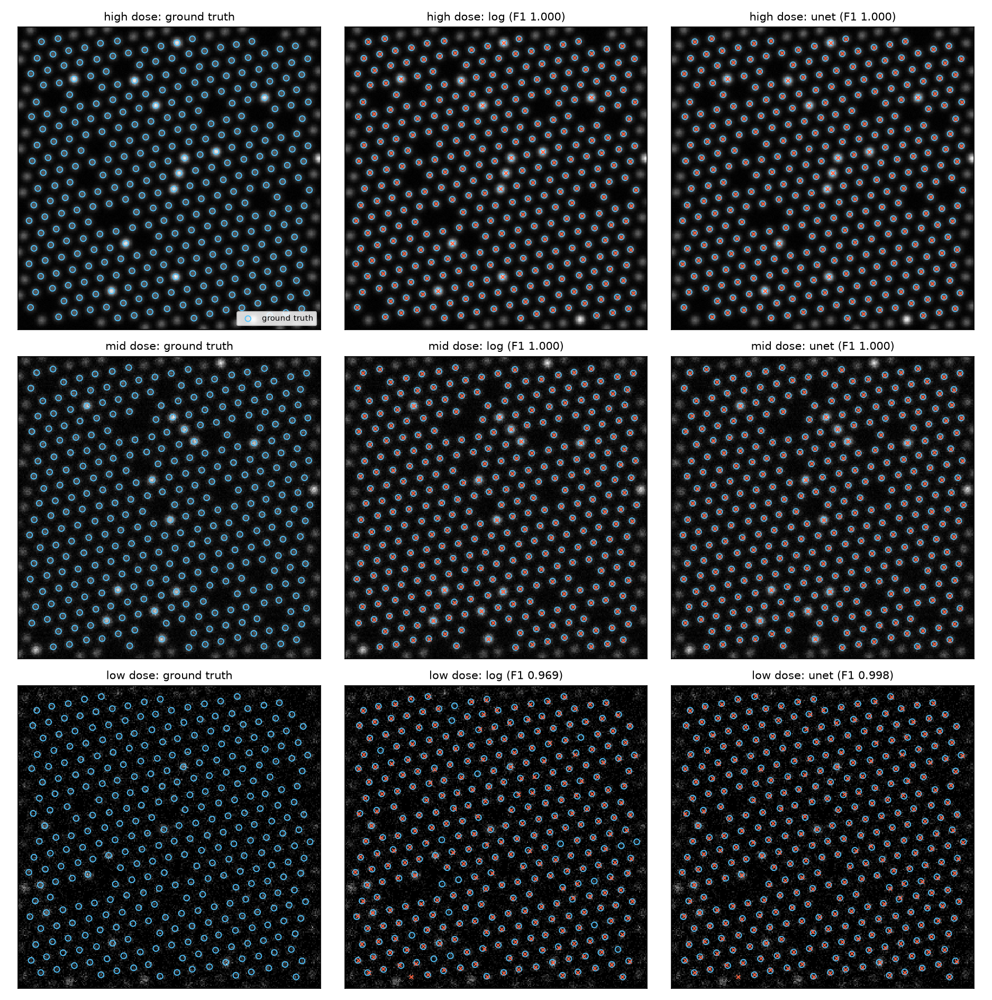
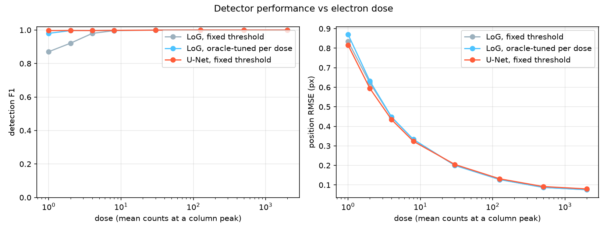

# stem-atom-finder

Atomic column detection in simulated HAADF-STEM images, comparing a classical
Laplacian-of-Gaussian detector against a 30k-parameter U-Net across a 2000x
range of electron dose. Everything runs on CPU in minutes, from a fully
synthetic, license-clean simulator with exact ground truth.

## Results

Detection F1 versus dose (mean electron counts at a column peak), 5 images per
dose, Hungarian matching at 4 px tolerance. Produced by
`scripts/benchmark_dose.py`, stored in `results/dose_sweep.json`.

| Dose | LoG, fixed threshold | LoG, oracle-tuned per dose | U-Net, fixed threshold | U-Net position RMSE (px) |
|---|---|---|---|---|
| 1 | 0.871 | 0.980 | 0.997 | 0.82 |
| 2 | 0.921 | 0.997 | 0.998 | 0.59 |
| 4 | 0.980 | 0.997 | 0.997 | 0.43 |
| 8 | 0.997 | 0.998 | 0.998 | 0.32 |
| 30 | 0.999 | 0.999 | 0.999 | 0.20 |
| 125 | 1.000 | 1.000 | 1.000 | 0.13 |
| 500 | 1.000 | 1.000 | 1.000 | 0.09 |
| 2000 | 1.000 | 1.000 | 1.000 | 0.08 |





Three findings, stated plainly:

- At moderate to high dose the problem is easy and every method is
  essentially perfect, with sub-pixel position accuracy down to 0.08 px RMSE
  after centre-of-mass refinement.
- The classical detector's weakness is not detection power but parameter
  sensitivity. With one fixed threshold it falls to F1 0.871 at dose 1; given
  an oracle that retunes its threshold at every dose using ground truth, it
  recovers to 0.980.
- The U-Net runs with a single fixed threshold everywhere and still delivers
  0.997 at dose 1, slightly ahead of even the oracle-tuned baseline. Its
  practical advantage is robustness across imaging conditions without
  retuning, not a large accuracy gap.

The oracle comparison matters: benchmarks that pit a learned model against a
classical method at one fixed, untuned setting overstate the learned model's
advantage. Here the baseline is given every legitimate assist and the honest
gap is reported.

## How it works

**Simulator** (`atomfinder.sim`): hexagonal or square lattice with random
rotation, column intensity scaling as Z^1.7 (incoherent Z-contrast), Gaussian
probe blur, random vacancies, brighter substitutional dopants, static
positional disorder, slow per-row scan jitter, and Poisson shot noise
controlled by a single dose parameter. Ground-truth positions are tracked
through the jitter distortion, so labels stay exact.

**LoG baseline** (`atomfinder.detect`): multi-scale scale-normalised
Laplacian of Gaussian with non-maximum suppression. No training.

**U-Net** (`atomfinder.net`, `atomfinder.train`): two-level encoder-decoder,
29,641 parameters, trained for 300 steps on freshly simulated images with
randomised lattice, defect rates and dose (log-uniform 2 to 2000), so it
never sees the same image twice. It predicts a per-pixel heatmap; peaks
become detections. Training takes a few minutes on CPU.

**Scoring** (`atomfinder.metrics`): optimal one-to-one Hungarian matching
within a 4 px tolerance, so a cluster of predictions cannot double-claim a
single true column. Precision, recall, F1 and matched-pair position RMSE.
All detections are refined to sub-pixel accuracy by iterative local centre
of mass (`atomfinder.refine`) before scoring.

## Install and reproduce

Python 3.11. CPU-only PyTorch is sufficient.

```
python -m venv .venv
.venv\Scripts\activate          # Windows; source .venv/bin/activate elsewhere
pip install torch --index-url https://download.pytorch.org/whl/cpu
pip install -e ".[dev]"
```

Run the demo on the three committed sample images (instant, uses the
committed model weights):

```
python scripts/demo.py
```

writes `results/metrics.json` and `figures/detection_overlay.png`. On the
committed low-dose sample (dose 2), the run behind the committed figures
gives LoG precision 0.997 / recall 0.943 / F1 0.969 and U-Net precision
0.997 / recall 1.000 / F1 0.998.

Everything else regenerates from scratch:

```
python scripts/generate_sample.py     # rewrite data/sample/*.npz (fixed seeds)
python scripts/train_unet.py          # retrain, save models/unet_atoms.pt
python scripts/benchmark_dose.py      # dose sweep, RESULTS table and figure
pytest                                # 30 tests
```

## Repository layout

```
src/atomfinder/     simulator, detectors, U-Net, refinement, metrics
scripts/            generate_sample, train_unet, demo, benchmark_dose
tests/              30 pytest tests
data/sample/        three committed synthetic images with ground truth
models/             committed 143 KB U-Net weights
figures/, results/  committed outputs of the scripts above
```

## Scope and limitations

- All data is synthetic, from a deliberately simple incoherent imaging
  model. No multislice simulation, no real experimental micrographs, and no
  claim that these numbers transfer to real instruments. On real data the
  domain gap (contamination, amorphous background, non-Poisson detector
  noise) would need to be addressed, most likely by fine-tuning on labelled
  experimental patches.
- The benchmark varies dose only; lattice geometry stays within the
  simulator's training distribution. The U-Net's robustness claim is about
  dose, not arbitrary out-of-distribution structures.
- Dopant and vacancy labels are simulated but only detection of column
  positions is evaluated; species classification is not implemented.

## Author

Aamir Malik

- GitHub: https://github.com/aamirmalik-dr
- LinkedIn: https://linkedin.com/in/dr-aamirmalik

## License

MIT. See [LICENSE](LICENSE).
